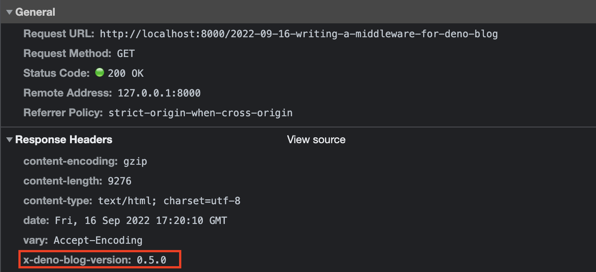

I have a blog, written in typescript and deno and hosted on [deno deploy](https://deno.com/deploy).
You probably know it, since you're already reading here! 😃

This blog is based on one of the first packages available for deno: the ["deno_blog"](https://deno.land/x/blog) package, 
started by Ryan Dahl as the creator of node an deno. 

The nice thing about this package is that you can get started with your blog in literally under an hour! 
If you're interested in an explanation how to do so, look at the following blogpost from Rajdeep Singh:  

https://www.freecodecamp.org/news/how-to-create-a-blog-with-deno/


## My Problem 

The not so nice thing is, that the documentation is sometimes a little incomplete. 
It shows, for example, that you can plug some middlewares into the webserver started by the blog package like this:  

```
 middlewares: [
    ga("UA-XXXXXXXX-X"),
    redirects({
      "/foo": "/my_post",
      // you can skip leading slashes too
      "bar": "my_post2",
    }),
  ],
```

Unfortunately, it doesn't show you, how to write such a middleware! 
But after diggig a bit in the source-code of this package, I found the solution!

## A Super Simple Blog Version Middleware 

My goal is to output the version of the "deno_blog" package somewhere on the blog, to be able to verify, 
that the correct version of this package is running in production. 

Since the code for this is __very__ small, i'll show it completely here: 

```
export const blogVersionMiddleware: BlogMiddleware = async (
  req: Request,
  ctx: BlogContext,
): Promise<Response> => {
  const res = await ctx.next();

  res.headers.append("X-DENO-BLOG-VERSION", "0.5.0");
  return res;
};
```

### What we see in this middleware snippet

First we see the signature of a Middleware for the deno_blog package, which is 

```
async (
  req: Request,
  ctx: BlogContext,
): Promise<Response>
```

So we get the `req` - Request Object and the `ctx` Render Context. 
But we want to change the response to include the version number of the "deno_blog" package! 

**So, how to we get the response?** 🧐

### The Trick for getting the Response 

This is the trick I found in the source code:  

```
const res = await ctx.next();
```

Obviously I have to execute ALL other middlewares and the request handler to get a response down the chain! 🙌  
Somehow I forgot this. 😅

So, now that we have the reponse object in `res`, we can simply modify it! 
I decided that I don't want to mess with the body content right now, since this middleware will be run for every page. 
So I put the deno_blog version in a custom header: 

```
res.headers.append("X-DENO-BLOG-VERSION", "0.5.0");
```

At the end I return the response to let the middleware chain finish it's job and that's all!  

With the next request you'll see the new header in the "Response Headers" section of ChromeDevTools network panel: 



Note: The version itself is currently hardcoded in the middleware and has to be updated manually when the version of the "deno_blog"
package gets bumped. Maybe I'll write something to automate this later. 

I hope this was helpful!  
If you have comments or questions, tweet at me at [@codemonument](https://twitter.com/codemonument)! 