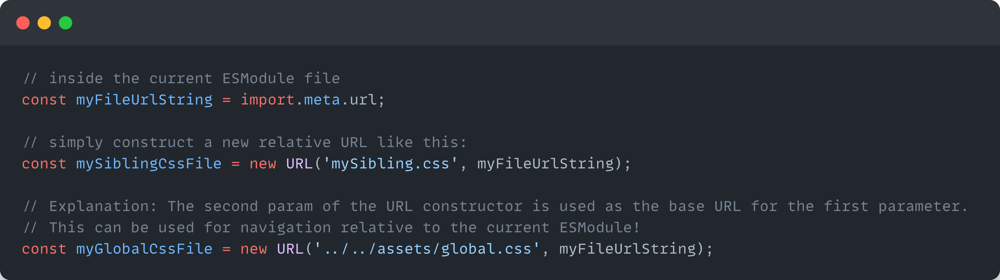

A friend asked me some days ago how he could import a css file relative to an ESModule js file in a browser, which got me on a little journey! 
The idea: ESModules can import other ESModules by simply importing them statically (via the `import {x} from 'package'` syntax), or by importing them dynamically (via `import(packageUrl)`). 
How can we do this with pure CSS files? 

## TL;DR 

1. If you need something stable for today, use `import.meta.url` in the js module as a base for the css url, then load the css via a style tag inserted into the dom. 
2. If you don't need Safari right now: Use [Constructable Stylesheets](https://web.dev/constructable-stylesheets/) together with `fetch()`! 
3. If you want to be even more adventurous, use the new [CSS Module Scripts](https://web.dev/css-module-scripts/#using-css-module-scripts) Syntax, which is only available in Chrome and Edge at the time of writing.

## Prerequisites - Getting the url of the current ESModule js file 

To load a css file relative to the currently loaded ESModule, we need the url to the folder of the currently loaded file first. (duh :D )
In node, we would use `__dirname` or `__filename`. 
In an ESModule we can access it via `import.meta.url`:

## 1st Option: The Safe Route

## 2nd Option: The (hopefully near) Future:  Constructable Stylesheets 
## 3rd Option: The more distant, but exciting Future: CSS Module Scripts!