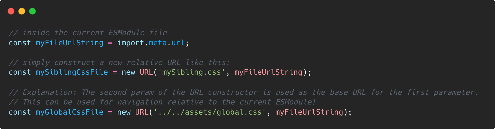
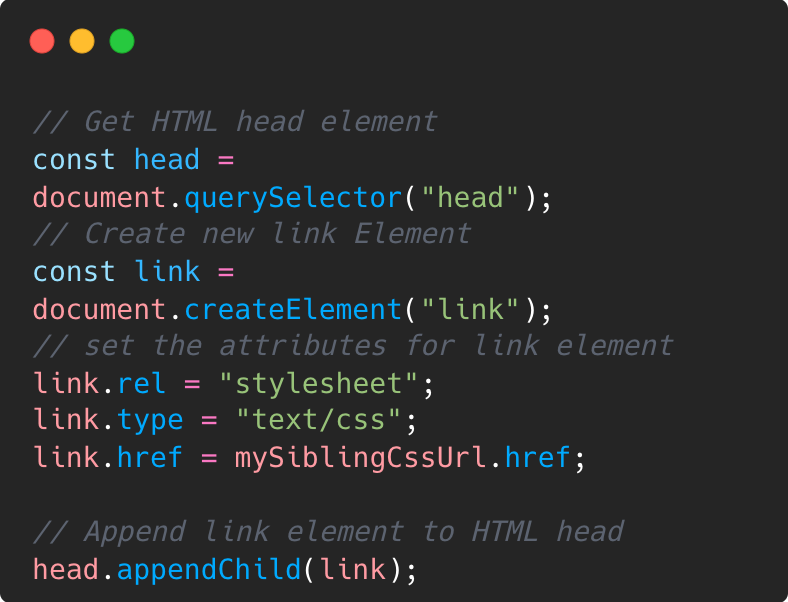
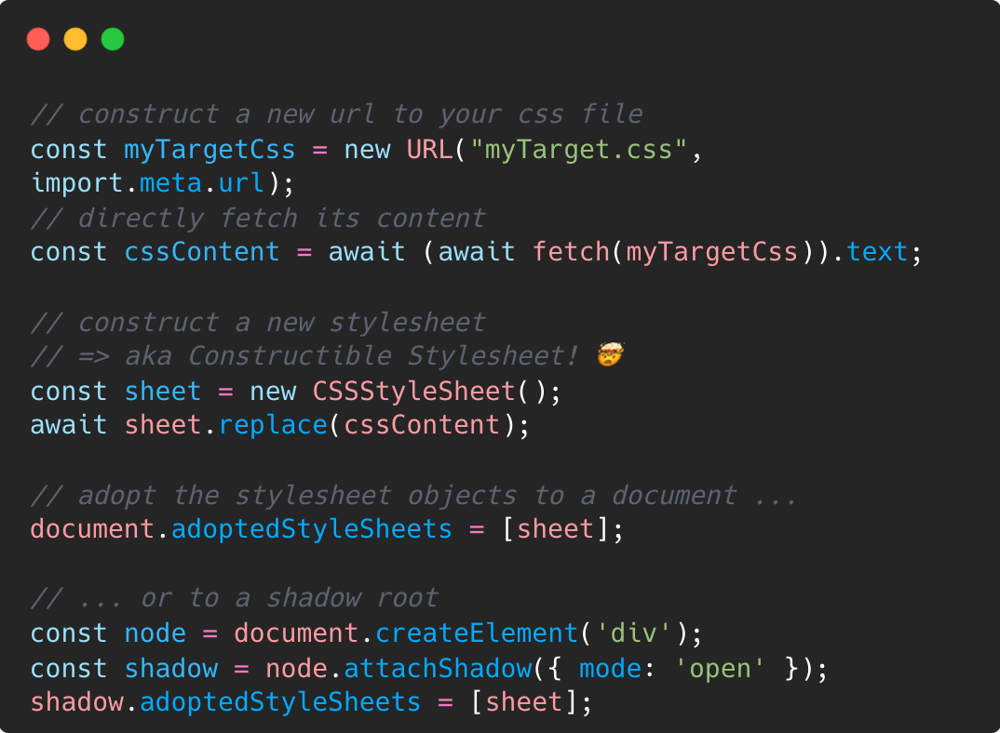
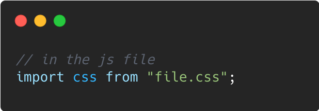
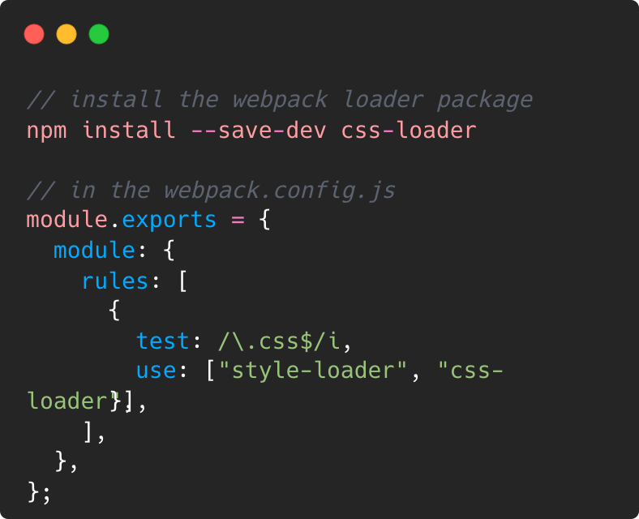

A friend asked me some days ago how he could import a css file relative to an ESModule js file in a browser, which got me on a little journey!  

**The Idea**  
ESModules can import other ESModules by simply importing them statically (via the `import {x} from 'package'` syntax), or by importing them dynamically (via `import(packageUrl)`).  

**How can we apply this to load pure CSS files?** 

&nbsp;  
## TL;DR 

1. Step 1 - If you need something stable for today, use `import.meta.url` in the js module as a base for the css url, then load the css via a style tag inserted into the dom. 

2. Step 2 - If you don't need Safari right now: Use [Constructable Stylesheets](https://web.dev/constructable-stylesheets/) together with `fetch()`! 
   
3. Step 3 - If you want to be even more adventurous, use the new [CSS Module Scripts](https://web.dev/css-module-scripts/#using-css-module-scripts) Syntax, which is only available in Chrome and Edge at the time of writing.

&nbsp;  
## Prerequisites - Getting the url of the current ESModule js file 

To load a css file relative to the currently loaded ESModule, we need the url to the folder of the currently loaded file first. (duh :D )
In node, we would use `__dirname` or `__filename`. 
In an ESModule we can access it via `import.meta.url`:

&nbsp;  
## The Safe Route: Import via `<link>` Tag 🤓

With the relative path to our css generated, we can simply add it into our document like this: 

But this way of importing css is not optimal. 
First, it forces us to construct another dom element, 
insert it into the dom and therefore stringify the resource into the dom. 
Second, it forces the browser to parse the new dom element, go on with fetching the target href, 
dowloading and parsing the css file and finally rendering all sections of the dom which are changed by the new stylesheet!

Sad 😥

&nbsp;  
## The (near) Future: Constructable Stylesheets 🤩
Fortunately, a solution is comming! 

This is called 'Constructible Stylesheets' and is currently available in Chrome, Edge and Firefox! (No Safari yet 😢)
The basic idea is: What if we could take any string of css and instruct the browser to parse this on demand and use it where we need it? 

Here's a snippet how this could be used with `fetch`!

### The Cool Parts
- No creation of a DOM node! 
  
- The css string could come from anywhere not only from a server, but also from a websocket connection or similar! 
  
- The same stylesheet instance can be applied to multiple documents and shadow roots, without duplicating the code inside! 
  => This can be used to have one design system stylesheet for all your webcomponents, for example!

### Some Gotchas

- No `@import` tags allowed in Constructible Stylesheets! They will simply be ignored

- The `sheet` object also as a `.replaceSync` function which blocks the main thread 
  when replacing the styles in the stylesheet object

&nbsp;  
## The coolest Future: CSS Module Scripts! 😍

Here comes the coolest thing: `CSS Module Scripts`! 

**But what should that be, you ask (slightly annoyed)?**

Lets take a step back and look at an option webdevs have known for a long time: 

### Webpack Loaders

With webpack loaders one can tell webpack how non-js filetypes should be loaded at build- or even at runtime! 
So we had many loaders, for json, svg, css and many more. 

With these loaders we could import css like this: 

This looks great! However, since it's not standard syntax, it would not work in browsers until we do this: 

This sounds way less exciting now, especially when thinking about the rest of the webpack config! 😞

### CSS Module Imports to the rescue! 

Browsers are working on a new Syntax for importing non-js files: The so called **Import Assertions**: 

### Import Assertions to the Rescue! (TC39 Proposal)

The exciting news is now the arrival of the 

&nbsp;  
## Further Reading 

These are some useful links where you can read more about all those technologies! 

- [MDN: Using import.meta](https://developer.mozilla.org/en-US/docs/Web/JavaScript/Reference/Operators/import.meta#using_import.meta)

- [GeeksForGeeks: Loading css files using Javascript](https://www.geeksforgeeks.org/how-to-load-css-files-using-javascript/amp/
)

- [web.dev: Constructable Stylesheets](https://web.dev/constructable-stylesheets/#constructing-a-stylesheet)

- [Caniuse: Constructable Stylesheets](https://caniuse.com/?search=Constructable%20Stylesheets)

- [webpack.js.org: css-loader](https://webpack.js.org/loaders/css-loader/)

- [web.dev: CSS Module Scripts](https://web.dev/css-module-scripts/#using-css-module-scripts)

- [stefanjudis.com: Import json files in ESModules](https://www.stefanjudis.com/snippets/how-to-import-json-files-in-es-modules/)

- [tc39-proposal: import assertions](https://github.com/tc39/proposal-import-assertions)