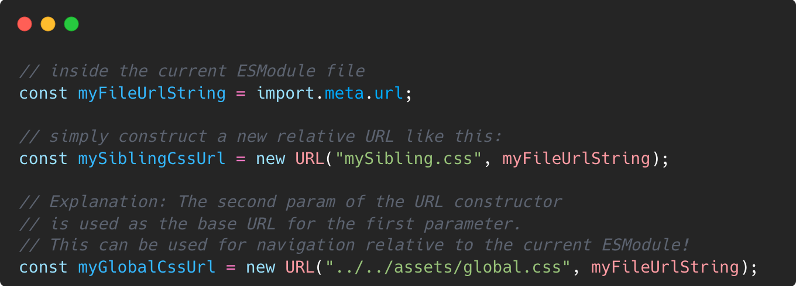

A friend asked me some days ago how he could import a css file relative to an ESModule js file in a browser, which got me on a little journey!  

**The Idea**  
ESModules can import other ESModules by simply importing them statically (via the `import {x} from 'package'` syntax), or by importing them dynamically (via `import(packageUrl)`).  

**How can we apply this to load pure CSS files?** 

## TL;DR 

1. Step 1 - If you need something stable for today, use `import.meta.url` in the js module as a base for the css url, then load the css via a style tag inserted into the dom. 

2. Step 2 - If you don't need Safari right now: Use [Constructable Stylesheets](https://web.dev/constructable-stylesheets/) together with `fetch()`! 
   
3. Step 3 - If you want to be even more adventurous, use the new [CSS Module Scripts](https://web.dev/css-module-scripts/#using-css-module-scripts) Syntax, which is only available in Chrome and Edge at the time of writing.

## Prerequisites - Getting the url of the current ESModule js file 

To load a css file relative to the currently loaded ESModule, we need the url to the folder of the currently loaded file first. (duh :D )
In node, we would use `__dirname` or `__filename`. 
In an ESModule we can access it via `import.meta.url`:

## The Safe Route: Import via `link` Tag

With the relative path to our css generated, we can simply add it into our document like this: 

But this way of importing css is not optimal. 
First, it forces us to construct another dom element, 
insert it into the dom and therefore stringify the resource into the dom. 
Second, it forces the browser to parse the new dom element, go on with fetching the target href, 
dowloading and parsing the css file and finally rendering all sections of the dom which are changed by the new stylesheet!

Sad 😥

## The (near) Future: Constructable Stylesheets 
Fortunately, a solution is comming! 

This is called 'Constructible Stylesheets' and is currently available in Chrome, Edge and Firefox! (No Safari yet 😢)
The basic idea is: What if we could take any string of css and instruct the browser to parse this on demand and use it where we need it? 

Here's a snippet how this could be used with `fetch`!

**Some Gotchas**

- No `@import` tags allowed in Constructible Stylesheets! They will simply be ignored

- The `sheet` object also as a `.replaceSync` function which blocks the main thread 
  when replacing the styles in the stylesheet object

## The (somewhat distant) Future: CSS Module Scripts!